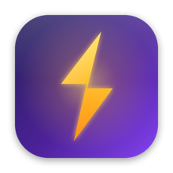

<div align="center">



# NoSleep Pro

**Keep your Mac wide awake with a single tap — even with the lid closed.**

One click keeps you awake. One click stops it. That's it.

</div>

---

## Why NoSleep Pro

Most "keep awake" apps only stop *idle* sleep — the moment you close the lid, your Mac sleeps anyway. NoSleep Pro is different: it keeps working **with the lid shut**, so you can close your laptop and let that download finish, keep a server alive, or run it in your bag.

- ⚡️ **Tap to stay awake, tap to stop.** A bolt lights up in your menu bar when you're awake.
- 💻 **Closed-lid mode.** The only reliable way to survive a lid close — built in.
- 🪶 **Feather-light.** Native AppKit, no Electron, no background daemons hogging your battery.
- ⏱ **Timers.** Keep awake for 15 minutes, an hour, or until you say stop.
- 🔒 **Private & minimal-privilege.** No network access. The one system permission it asks for is scoped to *exactly* one command.

## How to use it

| Action | What it does |
| --- | --- |
| **Click** the menu-bar bolt | Toggle keep-awake on / off. The bolt turns amber when active. ⚡️ |
| **Right-click** (or Control-click) | Open the menu: timers, options, and **Quit**. |

That's the whole app. Simple on the surface, serious underneath.

### The menu

- **Keep Awake / Turn Off** — same as clicking the icon
- **Keep Awake For →** 15 min · 30 min · 1 hour · 2 hours · 5 hours · Until I turn it off
- **Allow Lid to Close** — the closed-lid superpower (on by default)
- **Keep Display On** — also stop the screen from sleeping (off by default to save power)
- **Launch at Login**
- **Quit NoSleep Pro**

## How it works

NoSleep Pro layers two mechanisms so it's reliable everywhere:

1. **IOKit power assertion** — instant and privilege-free. Prevents idle system (and optionally display) sleep while the lid is open. This is the same mechanism macOS's own `caffeinate` uses.
2. **`pmset disablesleep`** — the *only* thing that stops **clamshell (lid-close) sleep**, which a power assertion cannot block. It needs root, so the first time you enable closed-lid mode NoSleep Pro asks for your password **once** and installs a tightly-scoped helper:

   ```
   <you> ALL=(root) NOPASSWD: /usr/bin/pmset disablesleep 1, /usr/bin/pmset disablesleep 0
   ```

   That rule can *only* toggle sleep — nothing else — and is validated with `visudo` before it's ever installed. After that, every toggle is instant and silent. Remove it anytime from the menu (**Remove Closed-Lid Helper…**).

**Safety:** NoSleep Pro always restores normal sleep when you quit, and defensively on launch. macOS also resets `disablesleep` on every reboot, so sleep can never get permanently stuck.

## Build & install

Requires macOS 13+ and the Xcode command-line tools.

```bash
git clone <this-repo>
cd NoSleepPro
./build.sh --install      # builds and copies NoSleep Pro to /Applications
```

Then launch **NoSleep Pro** from Spotlight or `/Applications`. Look for the ⚡️ in your menu bar.

> The build is ad-hoc signed for personal use. On first launch you may need to right-click the app → **Open**, or allow it under **System Settings → Privacy & Security**.

### Verify it works

```bash
build/NoSleepPro.app/Contents/MacOS/NoSleepPro --selftest
```

This exercises the real keep-awake engine and confirms the OS registers and releases the power assertion.

## Project layout

```
NoSleepPro/
├── Sources/
│   ├── Entry.swift        # @main entry point
│   ├── AppDelegate.swift  # menu-bar UI, click handling, menu, self-test
│   └── SleepGuard.swift   # the keep-awake engine (both layers)
├── Resources/
│   └── Info.plist         # LSUIElement menu-bar app
├── Icon/
│   └── generate_icon.swift  # renders the app icon from code
└── build.sh               # compile → bundle → sign
```

## License

MIT — see [LICENSE](LICENSE).

<div align="center"><sub>Extracted and reimagined from the <b>No Sleep</b> tool in QuickBar.</sub></div>
